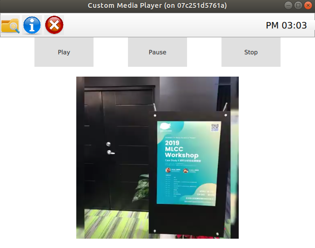

# QML and Custom MediaPlayer

Call the custom media player defined in c++ in QML

## Require

- Qt5.10+
- CMake & Ninja

## Build and Run

### 1. qmake

```bash
$ ./build.sh
```

### 2. CMake

```bash
$ ./cmake-build.sh
```

Results as below:


